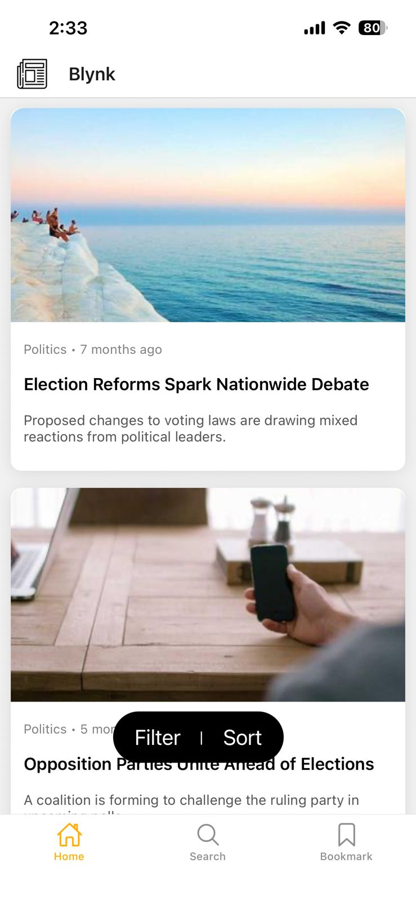
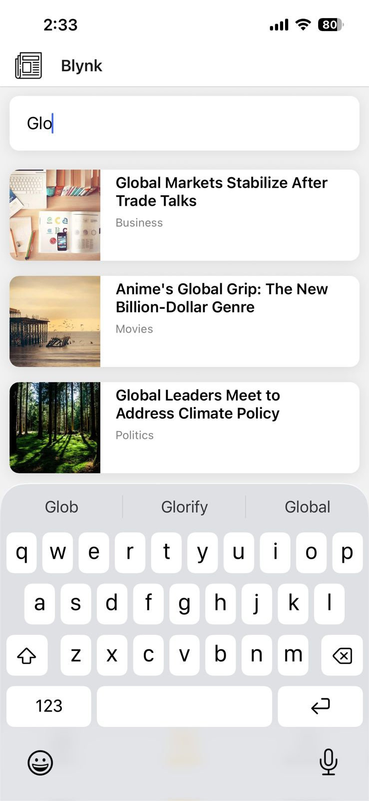
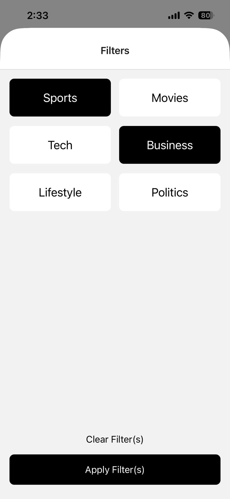
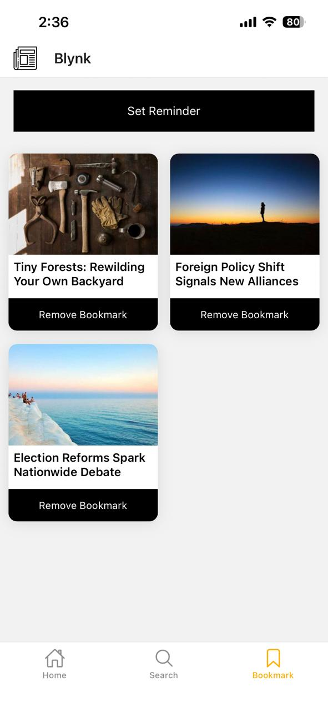
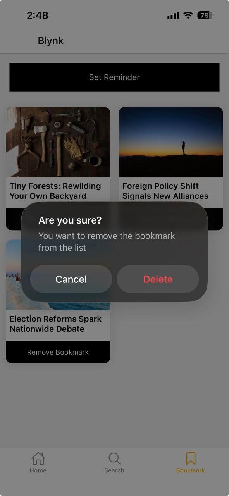

# 📰 Blynk – React Native News App

A modern **React Native news application** built using Expo, created to practice and implement concepts taught by **Kradi Kraman** in the *Frontend Masters React Native v3 course*.

---

## 📸 Screenshots

| 🏠 Home | 🔍 Search |
|--------|----------|
|  |  |

| 🎯 Filter | 🔖 Bookmarks |
|----------|-------------|
|  |  |

| 📄 Article Detail | 🔔 Alert |
|------------------|---------|
|  |  |

---

## 🚀 Features

- 🏠 Home – Displays news in card layout with image, genre, title, date, plus FAB for sorting and filtering via modals  
- 🔍 Search – Allows searching articles by title with instant results and navigation to details  
- 🔖 Bookmarks – Save and access articles with persistent storage using AsyncStorage  
- 📄 Article Details – Shows full content with formatted date and bookmark toggle option  

---

## 🧠 Concepts Covered

* 📁 File-based routing with Expo Router
* 🧭 Navigation (Tabs, Stack, Modals)
* 🌐 Global state management using Context API
* 💾 Persistent storage with AsyncStorage
* 🔔 Local notifications
* 📳 Haptic feedback integration
* 📅 Date formatting using date-fns
* 🔍 Search & filtering logic
* 🎯 UX-focused UI design patterns

---

## 📦 Dependencies Used

* expo-router – File-based navigation
* @react-native-async-storage/async-storage – Persistent data storage
* date-fns – Date formatting
* expo-haptics – Touch feedback
* expo-notifications – Local notifications
* @expo/vector-icons – Icons

---

## 🙌 Acknowledgements

* Course by **Kradi Kraman**
* Built as a hands-on learning project to strengthen React Native fundamentals

---

## 📃 License

This project is for learning and personal use.
